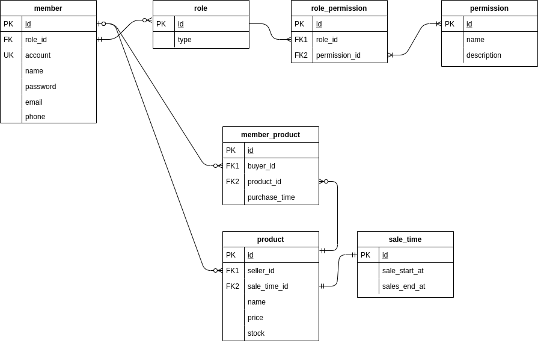
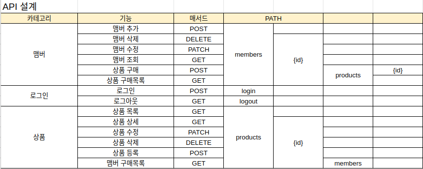

## 설계 
1. ERD 설계는 다음과 같다.<br>
   <br>

2. API 는 rest 규칙에 맞춰서 다음 그림과 같이 설계하였다.<br>
   

## API 문서
swagger 를 통해 확인한다
로컬 개발시, 앱 재생 후 `http://localhost:8080/swagger` 로 접속한다

## 로컬 개발 환경 세팅
1. java 설치한다
   * 버전 : corretto 17
   
2. mysql 같은 외부 앱 설치를 위해 docker 를 띄운다.
   * 명령어
     ```bash
     cd docker; docker-compose up -d
     ```
3. 앱을 실행한다
4. `http://localhost:8080/swagger` 로 접속하여 API 확인 후 요청한다